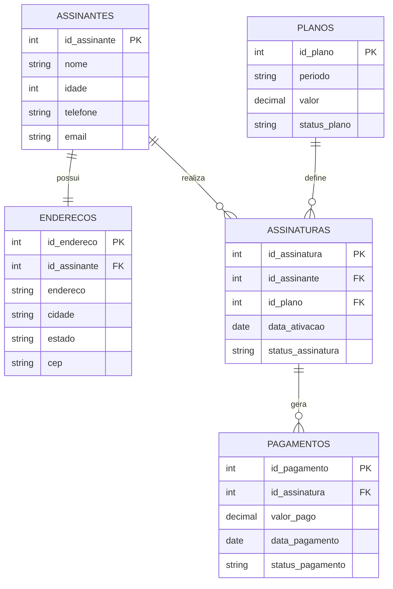

# 🖥️ Server Dados Assinantes

Sistema interno de gestão de assinantes de jornal, com interface administrativa inspirada em ferramentas como phpMyAdmin e banco de dados relacional estruturado.

---

## 🚀 Acesse o sistema

👉 https://izadantasnunes.github.io/server-dados-assinantes/

---

## 🎯 Objetivo do projeto

Simular um sistema corporativo real para controle de assinantes, permitindo:

- Gestão de clientes (assinantes)
- Controle de planos de assinatura
- Registro de pagamentos
- Visualização e manipulação de dados
- Estrutura de banco de dados profissional

Este projeto foi desenvolvido com foco em **operações de negócio, dados e tecnologia**, simulando um ambiente interno de empresa.

---

## 🧠 Modelo de Dados (DER)



---

## ⚙️ Funcionalidades

- 📋 Listagem de assinantes  
- ➕ Cadastro de novos assinantes  
- ✏️ Edição de registros  
- 🗑️ Exclusão de dados  
- 🔍 Busca e filtros  
- 📊 Relatórios básicos (receita, ticket médio, plano mais vendido)  
- 📁 Exportação de dados (CSV)  
- 💻 Console SQL simulado  
- 🧩 Navegação por tabelas (estilo painel administrativo)

---

## 🏗️ Estrutura do projeto

```text
SERVER-DADOS-ASSINANTES
├── index.html
├── README.md
├── src/
│   ├── styles.css
│   └── app.js
└── database/
    └── schema.sql
```

---

## 🛠️ Tecnologias utilizadas

- HTML5  
- CSS3  
- JavaScript (Vanilla)  
- SQL / MySQL  
- Git & GitHub  
- GitHub Pages  

---

## 🧩 Banco de Dados

O banco foi modelado com foco em um cenário real de negócio, incluindo:

- Assinantes  
- Endereços  
- Planos  
- Assinaturas  
- Pagamentos  

Arquivo SQL disponível em:

```
database/schema.sql
```

---

## 📊 Indicadores que podem ser analisados

- Total de assinantes ativos  
- Receita recorrente  
- Ticket médio  
- Planos mais vendidos  
- Base por localização  

---

## 💼 Sobre o projeto (visão profissional)

Este projeto simula um sistema interno de uma empresa de mídia, com foco na gestão de assinaturas e relacionamento com clientes.

A proposta foi desenvolver não apenas a interface, mas também a lógica de dados e a estrutura de banco, aproximando o projeto de um cenário real corporativo.

---

## 👩‍💻 Autora

**Izabelly Nunes**

- GitHub: https://github.com/izadantasnunes  
- LinkedIn: https://www.linkedin.com/in/izabelly-nunes  

---

## 🔥 Próximos passos (evolução do projeto)

- Integração com backend (Node.js ou Python)  
- Conexão com banco de dados real  
- API REST  
- Dashboard com dados dinâmicos  
- Autenticação de usuários  

---
